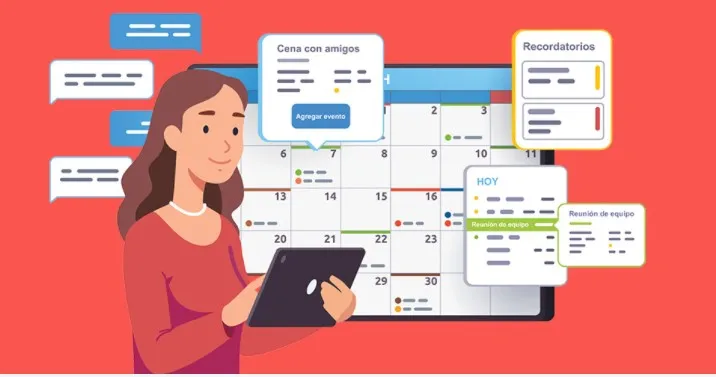
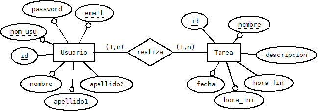
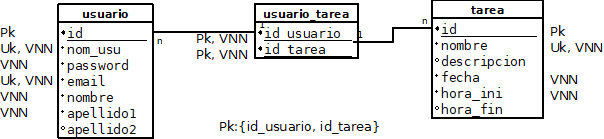

# APP Gestión de Tareas Multiusuario con Recordatorios




**Realizado por:** _Isabel Martí Romeu_

<p style="float: right; margin-right: 20px;">
  
</p>

**Centro:** CEEDV

**Ciclo:** DAM

**Curso:** Segundo

**Periodo:** Junio


**Tutor individual:** Mara Vaño Alonso.


## Introducción
Este proyecto trata de programar una APP multi usuario, con control de acceso y tareas compartidas.
A través de ella se podrá realizar:
- Gestión de Tareas: Los usuarios podrán agregar, editar, eliminar y marcar tareas como completadas, así como compartir tareas con otros usuarios.
Notificaciones y Recordatorios: Los usuarios podrán establecer recordatorios para tareas específicas.
- Sincronización con la Nube: Las tareas se sincronizarán en un servidor de base de datos en la nube, para que los usuarios puedan ver las tareas compartidas sin problemas.
- Base de Datos Local en SQLite: Almacena las tareas localmente en el dispositivo usando SQLite y se sincronizan con la nube con FIrebase Firestore.
- Interacción con API: La aplicación puede hacer uso de una API para obtener información adicional (por ejemplo, mostrar citas inspiradoras).

## Estado del arte
Este tipo de aplicaciones tiene una gran demanda en sectores que requieren un seguimiento eficiente de actividades, como proyectos personales, laborales y educativos. La siguiente sección presenta una revisión de los principales avances tecnológicos, marcos de trabajo y enfoques utilizados en el desarrollo de aplicaciones móviles similares, con especial énfasis en el uso de Kotlin, Firebase, y SQLite.

**Aplicaciones de Gestión de Tareas**

Las aplicaciones de gestión de tareas son fundamentales para la organización de actividades diarias, tanto a nivel personal como colaborativo. Algunas de las aplicaciones más populares en este ámbito incluyen Todoist, Trello, Microsoft To Do, y Google Keep. Estas aplicaciones permiten a los usuarios crear, editar, eliminar, organizar y compartir tareas de forma eficiente. Además, suelen incluir funcionalidades como la asignación de fechas de vencimiento, la creación de recordatorios, y la posibilidad de categorizar tareas mediante etiquetas o proyectos.

**Características comunes de estas aplicaciones:**

- Gestión de tareas: Creación, edición, eliminación y marcado de tareas como completadas.

- Tareas compartidas: Capacidad de compartir tareas o proyectos con otros usuarios.

- Notificaciones y recordatorios: Los usuarios pueden recibir notificaciones en tiempo real para recordarles las tareas pendientes.

- Sincronización en la nube: Sincronización de datos en tiempo real a través de servidores en la nube, lo que permite la accesibilidad desde varios dispositivos.


## Estudio de viabilidad. Método DAFO.

**Análisis DAFO (FODA)**

El análisis DAFO permite identificar las fortalezas, debilidades, oportunidades y amenazas del proyecto para el desarrollo de la aplicación de gestión de tareas.

_Fortalezas_

- Uso de tecnologías modernas: El uso de Kotlin y Firebase permite desarrollar una aplicación eficiente y escalable, aprovechando las mejores herramientas disponibles en la plataforma Android.

- Sincronización en tiempo real: La integración de Firebase Firestore garantiza que los usuarios tengan acceso a datos actualizados y colaboren en tiempo real.

- Autenticación segura: Firebase Authentication proporciona un sistema de control de acceso robusto y fácil de implementar.

- Funcionalidad fuera de línea: SQLite asegura que los usuarios puedan gestionar tareas incluso sin conexión a Internet.

_Debilidades_

- Dependencia de servicios externos: La dependencia de Firebase para la base de datos y la autenticación puede generar costos adicionales y problemas si los servicios de Firebase experimentan fallos o cambios en su política de precios.

- Compatibilidad con dispositivos antiguos: La aplicación requiere dispositivos con Android 5.0 o superior, lo que podría limitar el número de usuarios si no se considera bien la compatibilidad con versiones anteriores.

- Complejidad en la gestión de datos sincronizados: La sincronización de datos entre dispositivos puede generar errores si no se gestiona correctamente la lógica de conflicto de datos.

_Oportunidades_

- Creciente demanda de herramientas de productividad: Existe una creciente demanda de aplicaciones que ayuden a los usuarios a organizar y gestionar sus tareas de manera efectiva, especialmente en un entorno laboral remoto o colaborativo.

- Expansión a nuevas plataformas: La aplicación podría expandirse a otras plataformas como iOS, aumentando su alcance y base de usuarios.

- Implementación de funciones avanzadas: Se pueden agregar características adicionales como la gestión de proyectos, integración con otras aplicaciones de productividad, o un sistema de análisis del rendimiento de las tareas.

_Amenazas_

- Competencia intensa: Existen muchas aplicaciones de gestión de tareas bien establecidas en el mercado (como Todoist, Trello, Microsoft To Do), lo que puede dificultar la captación de usuarios.

- Cambio en políticas de servicios externos: Los cambios en los precios o en las condiciones de uso de servicios como Firebase o AdMob podrían afectar la rentabilidad o funcionalidad de la aplicación.

- Problemas de privacidad y seguridad: Dado que la aplicación manejará datos personales, un problema de seguridad o una filtración de datos podría dañar la reputación de la aplicación.

### Estudio de mercado

#### Viabilidad técnica/económica del proyecto
El siguiente análisis permitirá tomar decisiones sobre la viabilidad del proyecto y su posible ejecución.

_**Viabilidad Técnica**_

Es la capacidad de implementar la aplicación con las tecnologías disponibles e integrar todos los componentes necesarios para su funcionamiento.

a) Tecnologías a utilizar

**Lenguaje de programación:** Kotlin, el lenguaje oficial para el desarrollo de aplicaciones Android, es adecuado debido a su simplicidad, rendimiento y fuerte soporte por parte de Google.

**Base de datos:**

- **SQLite:** Para el almacenamiento local de tareas, permite mantener una copia local de las tareas en el dispositivo, incluso sin conexión a Internet.
- **Firebase Firestore:** Como base de datos en la nube para la sincronización en tiempo real de las tareas entre dispositivos, facilitando la colaboración entre usuarios.

**Notificaciones y recordatorios:**
- **Firebase Cloud Messaging (FCM):** Para implementar notificaciones push en tiempo real.
- **AlarmManager de Android:** Para programar recordatorios de tareas y establecer alarmas.

**Autenticación de usuarios:** Firebase Authentication proporcionará el control de acceso y la seguridad en el inicio de sesión.

b) Requerimientos técnicos.

- **Dispositivos compatibles:** La aplicación será compatible con dispositivos Android que cuenten con Android 5.0 (Lollipop) o superior.

- **Conexión a Internet:** Aunque la aplicación funcionará de forma local a través de SQLite, la sincronización de tareas en la nube requerirá conexión a Internet.

- **Desarrollo y pruebas:** El desarrollo se llevará a cabo en Android Studio con Kotlin. Las pruebas incluirán validaciones de funcionalidad, pruebas de usabilidad y control de errores.

c) Complejidad Técnica

El proyecto implica una complejidad moderada debido a la integración de varias tecnologías:

- Sincronización en tiempo real entre la base de datos local y la base de datos en la nube.
- Implementación de un sistema de notificaciones push eficiente.
- Gestión de múltiples usuarios con control de acceso.

Sin embargo, las herramientas y bibliotecas modernas disponibles (Firebase, SQLite, Kotlin) hacen que esta complejidad sea manejable.


_**Viabilidad económica**_

En este apartado se pretende analizar el coste asociado al desarrollo, mantenimiento y posibles ingresos generados por la aplicación.

a) Costos Iniciales
Los costos iniciales incluyen:

- Desarrollo de la aplicación: Los costos de contratación de desarrolladores (si no se realiza internamente) y herramientas de desarrollo como Android Studio (que es gratuita).

- Licencias de software: Firebase ofrece un plan gratuito con limitaciones. Es posible que a medida que la aplicación crezca, se requieran planes de pago para mayor capacidad de almacenamiento y número de usuarios.

- Pruebas y calidad: Contratación de testers para asegurar el correcto funcionamiento de la aplicación.

- Marketing y promoción: Presupuesto para campañas de marketing en Google Ads, redes sociales, o colaboraciones.

b) Costos Operativos

- Mantenimiento de servidores en la nube: El uso de Firebase tiene un coste asociado según el volumen de datos y el número de usuarios. A medida que la aplicación crece, se podría necesitar un plan de pago en Firebase.

- Actualizaciones y mejoras: Se deben presupuestar las actualizaciones periódicas de la aplicación, tanto para mantenerla compatible con las nuevas versiones de Android como para incorporar nuevas funcionalidades.

c) Posibles Fuentes de Ingresos

- Publicidad: Integrar anuncios dentro de la aplicación utilizando plataformas como Google AdMob.

- Modelo Freemium: Ofrecer una versión gratuita con funciones limitadas y una versión premium con características adicionales, como más espacio de almacenamiento o funciones avanzadas de colaboración.

- Suscripciones: Los usuarios podrían pagar una suscripción mensual o anual para acceder a características premium, como la personalización avanzada o una mayor capacidad de gestión de tareas.

**Recursos Hardware**

| Recurso                           | Costo Estimado                                 |
|-----------------------------------|------------------------------------------------|
| Portátil de Desarrollo            | 900 - 1,800 EUR por unidad                     |
| Teléfonos Android (para pruebas)  | 140 - 700 EUR por unidad                       |
| Tabletas Android (para pruebas)   | 180 - 550 EUR por unidad                       |
| Servidores (si no se usa la nube) | 45 - 450 EUR mensuales (si se usan servidores) |
| Periféricos                       | 140 - 450 EUR por unidad                       |

**Recursos Software**

| Recurso                                           | Costo Estimado                                                       |
|---------------------------------------------------|----------------------------------------------------------------------|
| Android Studio                                    | Gratuito                                                             |
| Kotlin                                            | Gratuito                                                             |
| Firebase                                          | Gratuito en el plan básico; 25 - 180 EUR mensuales en planes de pago |
| API Externas                                      | 0 - 45+ EUR mensuales                                                |
| Herramientas de Diseño (Adobe XD, Figma, etc.)    | 0 - 45 EUR mensuales                                                 |
| Herramientas de Pruebas (Firebase Test Lab, etc.) | 0 - 45 EUR mensuales                                                 |
| Publicidad (Google Ads, Facebook Ads)             | 90 - 900+ EUR mensuales                                              |

**Recursos Hardware**

Debido a que es un Proyecto fin de Ciclo, solamente contamos con una persona para desarrollar la aplicación

#### Viabilidad temporal

Para evaluar la viabilidad temporal, es necesario establecer un cronograma detallado que contemple todas las actividades clave en el proceso de desarrollo de la aplicación. Este cronograma debe ser realista, teniendo en cuenta los recursos disponibles (equipo de trabajo, herramientas y presupuesto).

**Factores a Considerar para la Viabilidad Temporal**

- Recursos Disponibles: El tiempo estimado puede variar según el tamaño del equipo de desarrollo y la disponibilidad de los recursos. Si el equipo es pequeño o si los desarrolladores están dedicando tiempo parcial al proyecto, los tiempos de desarrollo podrían alargarse.

- Complejidad del Proyecto: La integración de tecnologías como Firebase y la sincronización de datos en tiempo real puede generar desafíos adicionales, lo que puede retrasar el desarrollo si surgen problemas técnicos imprevistos.

- Pruebas y Corrección de Errores: Las fases de pruebas pueden extenderse si se detectan problemas significativos en la funcionalidad o en la experiencia del usuario, lo que podría requerir un tiempo adicional para corregir.

- Factores Externos: El proceso de aprobación de Google Play para la publicación de la aplicación podría llevar tiempo, especialmente si se requieren revisiones adicionales o correcciones en la aplicación.

### Planificación temporal o agenda de trabajo.

Se va a desarrollar un estudio de las fases en un entorno de trabajo real, aunque no se vayan a desarrollar por completo.

**Fases de Desarrollo de la Aplicación**

El proceso de desarrollo de la aplicación de gestión de tareas se puede dividir en varias fases principales.

| Fase                          | Duración Estimada | Fecha de Inicio     | Fecha de Finalización |
|-------------------------------|-------------------|---------------------|-----------------------|
| Planificación y Diseño        | 1-2 meses         | 1 de abril 2025     | 31 de mayo 2025       |
| Desarrollo Inicial            | 2-3 meses         | 1 de junio 2025     | 31 de agosto 2025     |
| Pruebas y Ajustes             | 1-2 meses         | 1 de septiembre 2025| 31 de octubre 2025    |
| Lanzamiento y Marketing       | 1 mes             | 1 de noviembre 2025 | 30 de noviembre 2025  |
| Monitoreo Post-Lanzamiento    | 1 semana          | 1 de diciembre 2025 | 7 de diciembre 2025   |


**Conclusión sobre la Viabilidad Temporal**

El proyecto tiene una viabilidad temporal razonable si se siguen los plazos establecidos y se cuenta con los recursos necesarios. Se estima que el desarrollo de la aplicación podría completarse en 6 a 8 meses desde el inicio hasta el lanzamiento, considerando las pruebas y el marketing inicial. 

Dado que solamente se dispone de una persona para el desarrollo de la aplicación, a tiempo parcial, habrá fases que no se lleven a cabo. 

Se implementará el MVP (Producto Mínimo Viable).

## Análisis de requisitos

1. Requisitos Funcionales

Los requisitos funcionales definen las funciones específicas que la aplicación debe realizar. En este caso, se enfoca en la gestión de tareas y la interacción entre los usuarios.

1.1. Gestión de Tareas

- Agregar tareas: Los usuarios podrán añadir nuevas tareas a la aplicación, con los siguientes campos:

  - Título de la tarea.

  - Descripción (opcional).

  - Fecha de vencimiento (opcional).

  - Prioridad (opcional).

- Editar tareas: Los usuarios podrán editar las tareas existentes, modificando cualquiera de los campos mencionados anteriormente.

- Eliminar tareas: Los usuarios podrán eliminar tareas que ya no deseen conservar.

- Marcar tareas como completadas: Los usuarios podrán marcar las tareas como completadas, lo que cambiará el estado de la tarea y la marcará visualmente en la lista.

- Filtrar tareas: Los usuarios podrán filtrar las tareas por fecha de vencimiento, prioridad y estado (completada/no completada).

1.2. Tareas Compartidas

- Compartir tareas: Los usuarios podrán compartir tareas con otros usuarios, proporcionando acceso a tareas específicas a través de un sistema de control de permisos.

- Visualización de tareas compartidas: Los usuarios podrán ver las tareas que les han sido compartidas, y, si tienen permisos, también podrán editarlas o completarlas.

1.3. Notificaciones y Recordatorios

- Recordatorios de tareas: Los usuarios podrán establecer recordatorios para las tareas. Los recordatorios deben enviarse en forma de notificación push en el momento seleccionado.

- Notificaciones push: Los usuarios recibirán notificaciones sobre actualizaciones de tareas compartidas, vencimientos de tareas y recordatorios establecidos.

1.4. Control de Acceso

- Autenticación de usuarios: Los usuarios deberán registrarse e iniciar sesión para acceder a la aplicación. Se implementará un sistema de autenticación utilizando Firebase Authentication.

- Roles y permisos: Cada usuario podrá tener permisos específicos sobre las tareas que son compartidas con ellos (por ejemplo, solo visualizar o también editar).

1.5. Sincronización en la Nube

- Sincronización de tareas: Las tareas se almacenarán en una base de datos local en el dispositivo (SQLite) y se sincronizarán con la nube usando Firebase Firestore para asegurar que las tareas estén disponibles en múltiples dispositivos de forma coherente.

- Sincronización en tiempo real: Las actualizaciones realizadas por un usuario deben reflejarse en tiempo real en todos los dispositivos que tengan acceso a la tarea compartida.

2. Requisitos No Funcionales

Los requisitos no funcionales especifican las cualidades y características generales que la aplicación debe cumplir, tales como el rendimiento, la seguridad y la usabilidad.

2.1. Rendimiento

- Tiempo de respuesta: La aplicación debe ser capaz de agregar, editar, eliminar y sincronizar tareas con tiempos de respuesta mínimos (menos de 2 segundos para la mayoría de las interacciones).

- Rendimiento de la sincronización: La sincronización con la nube debe ser rápida y eficiente, sin causar retrasos perceptibles en la experiencia de usuario.

- Soporte para múltiples usuarios: La aplicación debe ser capaz de gestionar múltiples usuarios y tareas de forma eficiente, incluso si un gran número de usuarios está utilizando la aplicación simultáneamente.

2.2. Usabilidad

- Interfaz amigable: La interfaz de usuario debe ser intuitiva y fácil de usar. Debe permitir la navegación rápida entre las diferentes pantallas y opciones.

- Diseño adaptativo: La aplicación debe ser completamente funcional tanto en teléfonos como en tabletas, con una interfaz que se adapte al tamaño de la pantalla.

- Accesibilidad: Se deben incorporar características de accesibilidad, como compatibilidad con lectores de pantalla y un diseño adecuado para personas con discapacidad visual o motriz.

2.3. Seguridad

- Protección de datos: La aplicación debe asegurar la confidencialidad de los datos de los usuarios, tanto en reposo como en tránsito. La autenticación debe ser segura, utilizando tecnologías como Firebase Authentication con medidas de seguridad como autenticación en dos pasos.

- Cifrado de comunicaciones: Todas las comunicaciones con Firebase y otros servicios externos deben estar cifradas utilizando HTTPS para prevenir interceptaciones.

2.4. Escalabilidad

- Capacidad de escalar: La infraestructura de backend debe ser capaz de manejar un crecimiento en el número de usuarios sin que esto afecte el rendimiento de la aplicación. Firebase Firestore debe ser capaz de manejar la cantidad de datos y usuarios sin problemas.

3.Requisitos Técnicos

Los requisitos técnicos detallan las tecnologías, herramientas y plataformas que se utilizarán para desarrollar y ejecutar la aplicación.

3.1. Plataforma de Desarrollo

Android Studio como entorno de desarrollo principal.

Lenguaje de programación Kotlin para la implementación de la lógica de la aplicación.

3.2. Base de Datos

- Base de datos local: SQLite se utilizará para almacenar las tareas localmente en el dispositivo cuando no haya conexión a Internet.

- Base de datos en la nube: Firebase Firestore se usará para almacenar las tareas de manera remota y permitir la sincronización entre dispositivos.

3.3. Integración con Firebase

- Autenticación: Se implementará Firebase Authentication para permitir que los usuarios se registren y accedan de forma segura.

- Base de datos en la nube: Firebase Firestore se utilizará para almacenar y sincronizar las tareas.

- Notificaciones: Firebase Cloud Messaging (FCM) se integrará para gestionar las notificaciones push y los recordatorios.

3.4. API Externa

Interacción con API externa: La aplicación hará uso de una API externa para obtener citas inspiradoras que amplíen la experiencia de usuario.

## Diseño

Para describir la base de datos se va a utilizar la notación Yourdon, DeMarco.

### Diseño Conceptual Entidad Relación.



Un usuario puede realizar muchas tareas y una tarea puede ser realizada por varios usuarios.

### Diseño Lógico Relacional o Paso a tablas.




### Diseño Físico o Diagrama Mysql. Descripción de las tablas y campos.
```
Usuario:{id:INTEGER(4), nom_usu:VARCHAR(20), password:VARCHAR(20), email:VARCHAR(30), nombre:VARCHAR(20), apellido1:VARCHAR(20), apellido2:VARCHAR(20)}
Pk: id
Uk: nom_usu
Uk: email
VNN: nom_usu, password, email, nombre, apellido1
```
```
Tarea:{id: INTEGER(8), nombre:VARCHAR(20), descripcion:TEXT, fecha:DATE, hora_ini:TIME, hora_fin:TIME}
Pk: id
VNN: nombre, fecha, hora_ini
Uk: nombre
```
```
usuario_tarea:{id_usuario:INTEGER(4), id_tarea:INTEGER(8)}
Pk:{id_usuario,id_tarea}
VNN: id_usuario, id_tarea
FK: id_usuario referencia a Usuario(id)
Fk: id_tarea referencia a Tarea(id)
```
### Mapa Web. Gráfico que muestra los enlaces entre páginas.
### Mockups


## Codificación
### Tecnologías elegidas y su justificación.
### Entorno servidor.
### Entorno cliente.
### Documentación interna de código
### Documentación externa. Manual de usuario.


## Despliegue


## Herramientas de apoyo
- Firebase

  https://console.firebase.google.com/
  
## Conclusiones
- Acceso a la memoria

  https://isabelmartiromeu.github.io/appnotificaciones

## Bibliografía

- Plantillas Jekyll para Github

  https://pages.github.com/themes/

